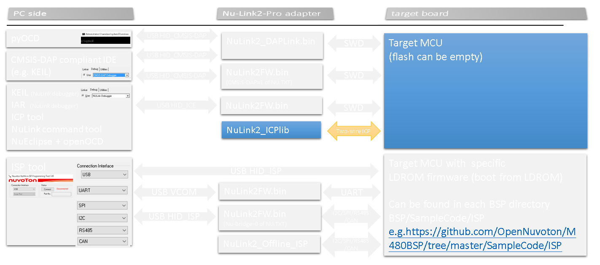

# ICPLib and Sample code to program NuMicro CortexM and 8051 series  

there are two sample projects  
- ICPLibDemo: NuMicro-M (use ICP.lib)	  
- ICP51LibDemo: 8051 (use ICP51.lib)

schematic: refer to ICEDAT,ICECLK,ICERST pins  
Nu-Link2_V2.4_Schematic.pdf     (PA9 DAT, PA10 CLK, PF5 RST)
    
    